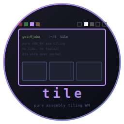

# tile - Pure Assembly Tiling Window Manager




Tiling window manager written in x86_64 Linux assembly. No libc, no
toolkit, pure syscalls. Speaks X11 wire protocol directly via Unix
socket.

Part of the **[CHasm](https://github.com/isene/chasm)** (CHange to ASM)
suite, alongside [bare](https://github.com/isene/bare) (shell),
[show](https://github.com/isene/show) (file viewer), and
[glass](https://github.com/isene/glass) (terminal emulator).

<br clear="left"/>


A tile-managed desktop: row-of-squares bar across the top, tabs on
the left, workspace indicators on the right, glass panes in a
master/stack layout, **strip** + the **asmites** (the per-segment
programs in [chasm-bits](https://github.com/isene/chasm-bits))
driving the status row above tile's bar, **show** in the left +
bottom-right panes, **bare** behind the prompt. Every binary on
screen is pure x86_64 assembly.

**Status: daily-driver since 2026-04 (the author runs nothing else).**
See [PLAN.md](PLAN.md) for the full architecture and roadmap, and
[CONFIG-FUTURE.md](CONFIG-FUTURE.md) for hardcoded constants that may
become `~/.tilerc` keys later.

## Goals

- Replace i3 + i3bar + i3status + conky + stalonetray for the
  author's daily workflow
- No floating windows. Tiling only.
- Tabbed layout as default (matches typical vim/glass usage)
- Smart workspace cycling (Win+Right/Left walks only populated
  workspaces; Win+N jumps direct)
- Workspace pinned to output (external monitor always shows a
  designated workspace)
- A real bar (`strip`) with system tray (XEMBED) — coming in phase 2

## Build (requires nasm and ld)

```bash
git clone https://github.com/isene/tile.git
cd tile
make
```

## Run safely under Xephyr (development)

[Xephyr](https://www.freedesktop.org/wiki/Software/Xephyr/) is a
nested X server that runs as a window inside your existing X
session. tile inside Xephyr cannot affect your host i3/Gnome/KDE
session, so a crash or bug just kills the Xephyr window.

```bash
sudo apt install xserver-xephyr        # Debian/Ubuntu (Arch: xorg-server-xephyr)

make xephyr                            # windowed Xephyr (1280x800)
make xephyr-multi                      # dual-output simulation (+xinerama)
```

### A subtlety about keybindings

Xephyr (even with `-fullscreen`) does **not** shield keystrokes from
the host window manager. The host WM's passive key grabs fire first —
if your host i3 binds `Mod4+Return`, then `Mod4+Return` typed inside
Xephyr is captured by i3, not delivered to tile.

For development under i3, bind tile to chords i3 doesn't grab. Alt is
essentially unused by typical i3 configs, so the built-in defaults
(when there is no `~/.tilerc`) are:

| Key | Action |
|-----|--------|
| `Alt+Return`  | Spawn glass |
| `Alt+q`       | Close the focused window cleanly (WM_DELETE_WINDOW) |
| `Alt+Shift+q` | Exit tile |

Once you cold-switch from i3 to tile on real hardware, `Mod4+`-style
binds work fine — see `tilerc.example` for the config syntax.

To launch a test app inside the Xephyr session:

```bash
DISPLAY=:9 glass                        # or: DISPLAY=:9 xterm
```

## Current capabilities

- X11 wire protocol over Unix socket, MIT-MAGIC-COOKIE-1 authentication
- Claims SubstructureRedirectMask on the root (single-WM enforcement)
- ICCCM `WM_DELETE_WINDOW` — `kill` asks the app to close cleanly
- **10 workspaces** with `workspace N` / `move-to N` / smart cycling
  (`workspace next-populated` walks only populated workspaces) /
  `workspace back-and-forth`
- **Per-workspace layout**: TABBED, SPLIT_H, SPLIT_V, MASTER. New
  windows append; cycle / reorder / move tabs across workspaces.
  Closing the active tab auto-focuses the next-most-recent one.
  Tab cycling in TABBED reconfigures the new active before mapping,
  so siblings sized in MASTER/SPLIT take the full TABBED geometry
  on cycle (no half-screen leftovers).
- **Multi-output (Xinerama)** with workspace-pinned outputs: a
  designated workspace always shows on the external monitor.
- **Row-of-squares bar** at the very top: WS squares grouped
  `[1 2 3]·[4 5 6]·[7 8 9]·[0]` with configurable per-WS colour
  overrides, vertical separator bar, layout-mode glyph (TABBED ☰,
  SPLIT_H ▌▐, SPLIT_V ▀▄, MASTER ▌▘▖), then the tab strip
  (current = bright, others dimmed). `tab-color-cycle` rotates a
  per-tab colour through `tab_palette`.
- **strip status row** (companion bar) with text segments fed by
  the [chasm-bits](https://github.com/isene/chasm-bits) asmites
  (clock, battery, cpu, mem, disk, net, mailbox, brightness, vol,
  weather, wintitle). Per-segment refresh interval, `+N` leading-gap
  override, default-fg colour, all driven by `~/.striprc`.
- **XEMBED system tray** (phase 2c) — apps that emit `_NET_WM_S0`
  selection requests dock into strip's tray area.
- **Stash / unstash** — i3 scratchpad replacement: a small LIFO of
  unmapped tabs you can pop back to the current workspace.
- **In-place restart** — `restart` action does
  `execve("/proc/self/exe")`, picking up a freshly-built tile binary
  without losing any X clients (X owns the windows, WM just
  reconnects).
- WM-initiated unmaps don't get treated as window-closed
- `~/.tilerc` and `~/.striprc` config parsers (reload via SIGUSR1)

See `tilerc.example` for the full config syntax. Recognised
statements: `bind <chord> <action> [arg]`, `exec <cmdline>`,
`key = value` for bar appearance, `# comments`.
Modifiers: `Shift`, `Ctrl`/`Control`, `Alt`/`Mod1`, `Mod4`/`Win`/`Super`.
Actions: `exec`, `exec-here`, `kill`, `exit`, `workspace`, `move-to`,
`focus`, `move-tab`, `tab-color-cycle`, `stash`, `unstash`, `layout`,
`spawn-split`, `reload`, `restart`.

## License

[Unlicense](https://unlicense.org/) (public domain)
